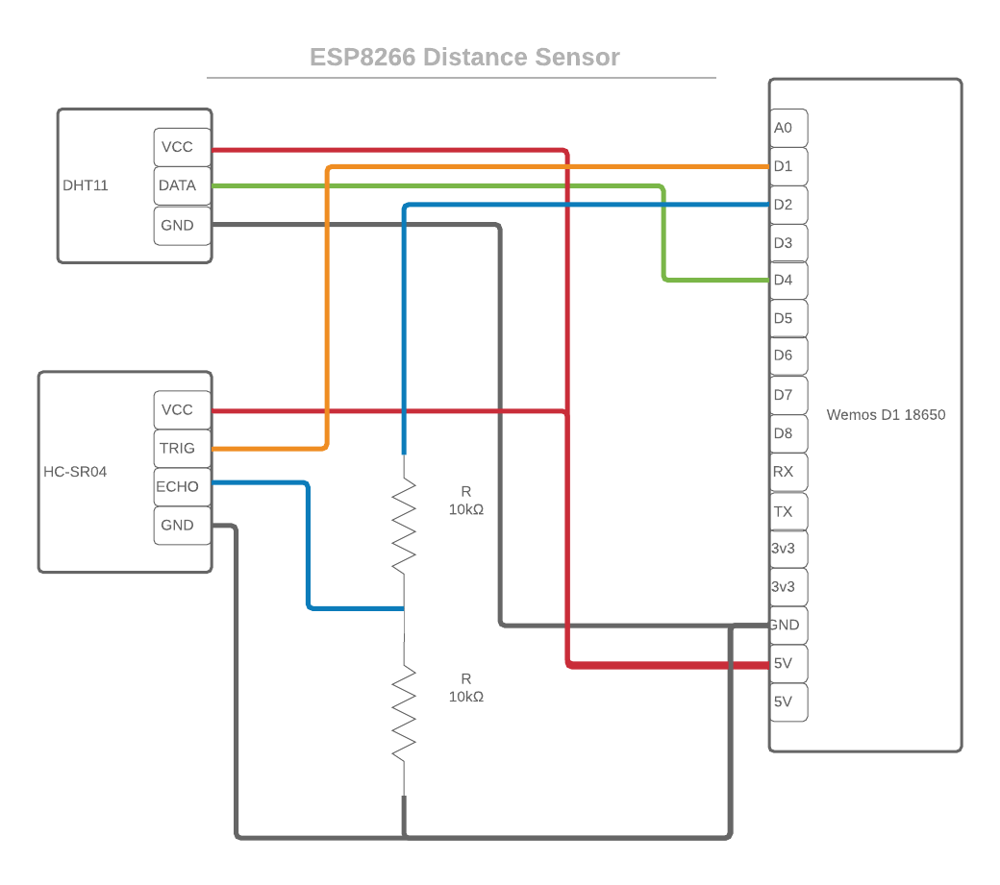

# esp8266-openhab-distanceSensor
A simple esp8266 distance sensor for openhab

# Parts
[Makerfocus Wemos D1 Mini WiFi Module](https://www.amazon.com/gp/product/B075H8X7H2/)

[HC-SR04 Ultrasonic Sonar Distance Sensor with 2x 10k resistors](https://www.adafruit.com/product/3942)

[DHT11 Temperature and Humidity sensor](https://www.amazon.com/gp/product/B01DKC2GQ0/)

# Schematic

# Motivation
I wanted a sensor that could monitor the amount of salt in my water softener tank.  I also wanted a low level on that
sensor to result in an email notification.  Capturing temperature and humidity was a bonus use of extra digital pins
